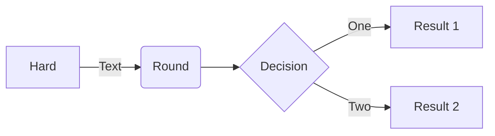
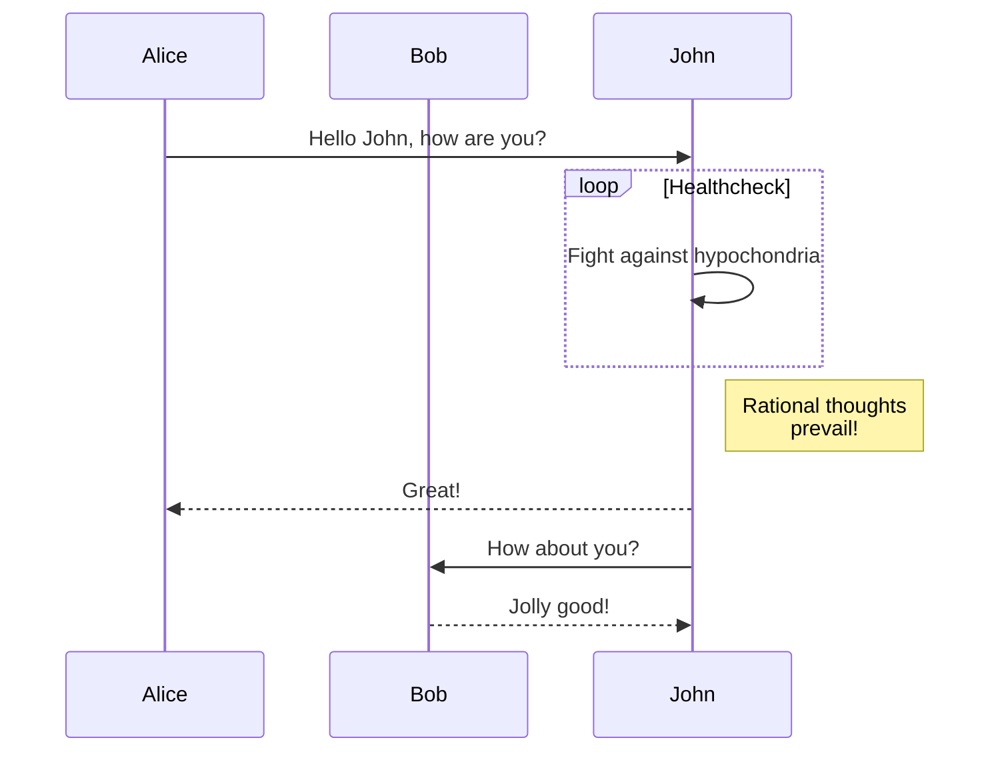
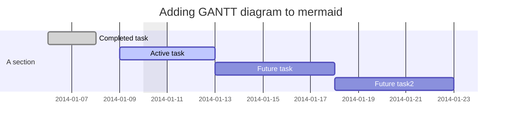
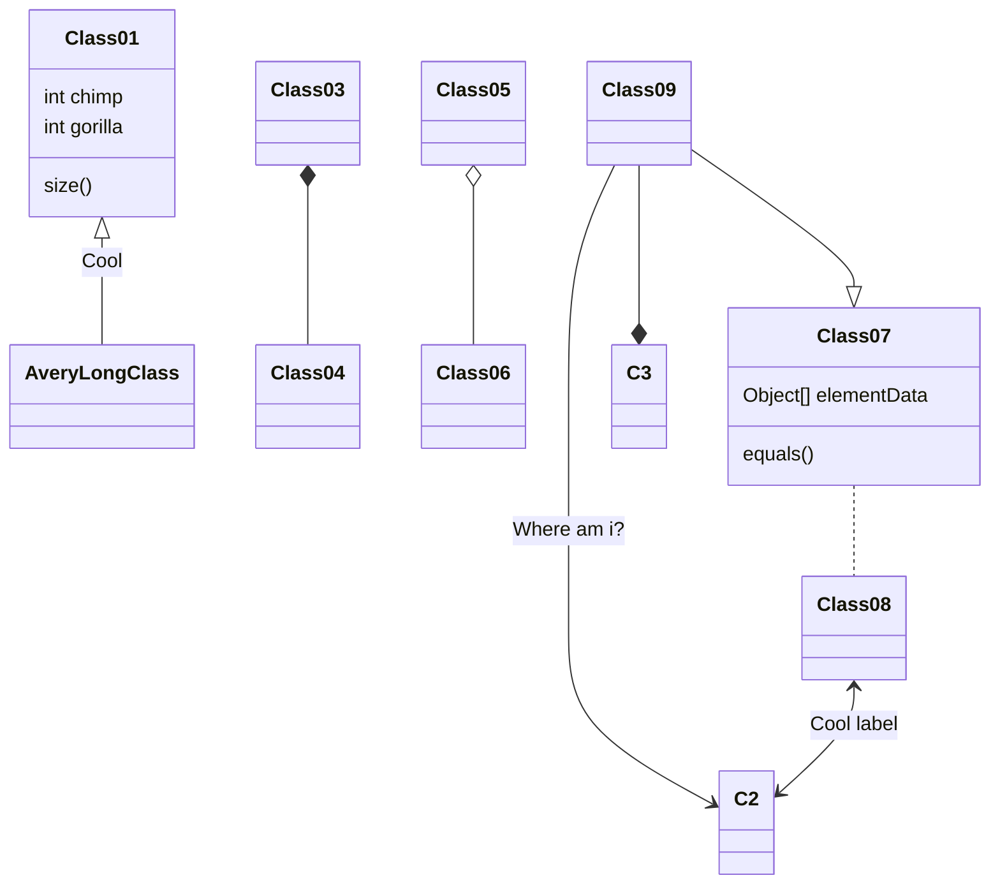
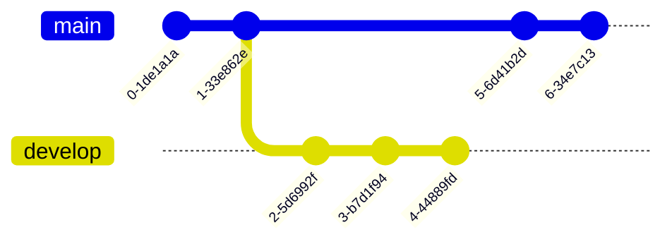
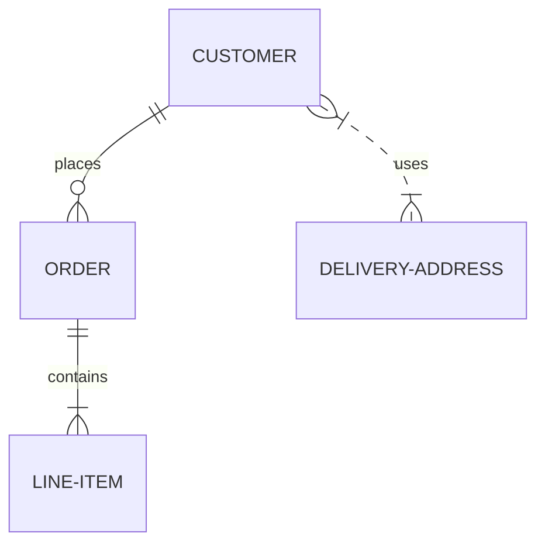

# This is the **HOMEPAGE**.
Refer to [Markdown](http://daringfireball.net/projects/markdown/) for how to write markdown files.
## Quick Start Notes:
1. Add images to the *images* folder if the file is referencing an image.

## Alerts
> [!NOTE]
> This is a note.

> [!TIP]
> This is a tip.

> [!IMPORTANT]
> This is important.

> [!CAUTION]
> This is a caution.

> [!WARNING]
> This is a warning.

## Video
This is an embeded video:

> [!Video https://www.youtube.com/embed/Sz1lCeedcPI]

## Mermaid
Testing mermaid support

